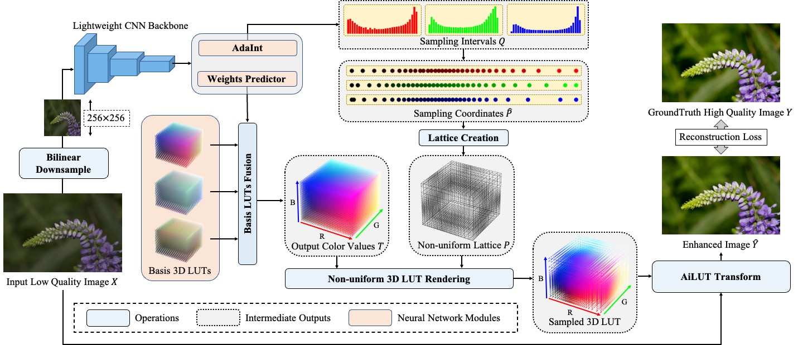

# AdaInt: Learning Adaptive Intervals for 3D Lookup Tables on Real-time Image Enhancement

## Introduction

The codebase provides the official PyTorch implementation and some model checkpoints for the paper ["AdaInt: Learning Adaptive Intervals for 3D Lookup Tables on Real-time Image Enhancement"](https://arxiv.org/abs/2204.13983) (accepted by CVPR 2022).

<p align="center">
  
</p>

AdaInt (**Ada**ptive **Int**erval) is an effective and efficient mechanism for promoting learnable 3D lookup tables (LUTs) on the real-time image enhancement task, which can be implemented as a plug-and-play neural network module. The central idea is to introduce image-adaptive sampling intervals for learning a non-uniform 3D LUT layout. To enable the learning of non-uniform sampling intervals in the 3D color space, a differentiable AiLUT-Transform (**A**daptive **I**nterval **LUT Transform**) operator is also proposed to provide gradients to the
sampling intervals. Experiments demonstrate that methods equipped with AdaInt can achieve state-of-the-art performance on two public benchmark datasets with a negligible overhead increase.

The codebase is based on the popular MMEditing toolbox ([v0.11.0](https://github.com/open-mmlab/mmediting/tree/v0.11.0)). Please refer to [ori_README.md](https://github.com/open-mmlab/mmediting/blob/v0.11.0/README.md) for the original README.

## Code Structure

- `mmedit/`: the original MMEditing toolbox (without any modification).
- `adaint/`: the core implementation of the paper, including:
  - `annfiles/`: including the annotation files for FiveK and PPR10K datasets.
  - `dataset.py`: the dataset class for image enhancement (FiveK and PPR10K).
  - `transforms.py`: including some augmentations not provided by MMEditing toolbox.
  - `ailut_transform/`: including the python interfaces, the C++ CUDA implementation, and the wheel package of the proposed AiLUT-Transform.
  - `model.py`: the implementation of AiLUT model (3D-LUT + AdaInt).
  - `configs/`: including configurations to conduct experiments.
  - `metrics/`: including MATLAB scripts to calculate metrics reported in the paper.
  - `demo.py`: a python script to run a demo.
- `pretrained/`: including the pretrained models.

## Prerequisites

### Hardware

- CPU: Intel(R) Xeon(R) Platinum 8163 CPU @ 2.50GHz
- GPU: NVIDIA Tesla V100 SXM2 32G

### Dependencies

- Ubuntu 18.04.5 LTS
- Python 3.7.10
- PyTorch 1.8.1
- **GCC/G++ 7.5**
- **CUDA 10.2**
- **MMCV 1.3.17**
- **MMEditing 0.11.0**

### Installation

You can set up the MMEditing toolbox with conda and pip as follows:

```shell
conda install -c pytorch pytorch=1.8.1 torchvision cudatoolkit=10.2 -y
pip install -r requirements.txt
pip install -v -e .
```

The proposed AiLUT-Transform is implemented as a PyTorch CUDA extension. You can install the extension in either the following two ways:

- Compile and install the extension manually.

```shell
python adaint/ailut_transform/setup.py install
```

- Use the pre-compiled python wheel package in `./adaint/ailut_transform`.

```shell
pip install adaint/ailut_transform/ailut-1.5.0-cp37-cp37m-linux_x86_64.whl
```

Note that the CUDA extension should be compiled and packaged using Python 3.7.10, PyTorch 1.8.1, GCC/G++ 7.5, and CUDA 10.2. If you fail to install the extension or encounter any issue afterward, please first carefully check your environment accordingly.

In case you would like to remove the installed AiLUT-Transform extension, please execute the following command:

```shell
pip uninstall ailut
```

## Demo

We provide a quick demo script in `adaint/demo.py`. You can execute it in the following way:
```shell
python adaint/demo.py [CONFIG_FILE] [MODEL_CHECKPOINT] [INPUT_IMAGE_PATH] [OUTPUT_IMAGE_PATH]
```

For quick testing, we provide a pretrained model in `./pretrained/AiLUT-FiveK-sRGB.pth` and an input image from the FiveK dataset in 8-bit sRGB format (`./resources/a4739.jpg`). You can conduct enhancement on it using the below command:
```shell
python adaint/demo.py adaint/configs/fivekrgb.py pretrained/AiLUT-FiveK-sRGB.pth resources/a4739.jpg resources/a4739_enhanced.png
```
The enhanced result can be found in `resources/a4739_enhanced.png`.

## Datasets

The paper use the [FiveK](https://data.csail.mit.edu/graphics/fivek/) and [PPR10K](https://github.com/csjliang/PPR10K) datasets for experiments. It is recommended to refer to the dataset creators first using the above two urls.

### Download

- FiveK

You can download the original FiveK dataset from the dataset [homepage](https://data.csail.mit.edu/graphics/fivek/) and then preprocess the dataset using Adobe Lightroom following the instructions in [Prepare_FiveK.md](Prepare_FiveK.md).

For fast setting up, you can also download only the 480p dataset preprocessed by Zeng ([[GoogleDrive](https://drive.google.com/drive/folders/1Y1Rv3uGiJkP6CIrNTSKxPn1p-WFAc48a?usp=sharing)],[[onedrive](https://connectpolyu-my.sharepoint.com/:f:/g/personal/16901447r_connect_polyu_hk/EqNGuQUKZe9Cv3fPG08OmGEBbHMUXey2aU03E21dFZwJyg?e=QNCMMZ)],[[baiduyun](https://pan.baidu.com/s/1CsQRFsEPZCSjkT3Z1X_B1w):5fyk]), including 8-bit sRGB, 16-bit XYZ input images and 8-bit sRGB groundtruth images.

After downloading the dataset, please unzip the images into the `./data/FiveK` directory. Please also place the annotation files in `./adaint/annfiles/FiveK` to the same directory. The final directory structure is as follows.

```
./data/FiveK
    input/
        JPG/480p/                # 8-bit sRGB inputs
        PNG/480p_16bits_XYZ_WB/  # 16-bit XYZ inputs
    expertC/JPG/480p/            # 8-bit sRGB groundtruths
    train.txt
    test.txt
```

- PPR10K

We download the 360p dataset (`train_val_images_tif_360p` and `masks_360p`) from [PPR10K](https://github.com/csjliang/PPR10K) to conduct our experiments.

After downloading the dataset, please unzip the images into the `./data/PPR10K` directory. Please also place the annotation files in `./adaint/annfiles/PPR10K` to the same directory. The expected directory structure is as follows.

```
data/PPR10K
    source/       # 16-bit sRGB inputs
    source_aug_6/ # 16-bit sRGB inputs with 5 versions of augmented
    masks/        # human-region masks
    target_a/     # 8-bit sRGB groundtruths retouched by expert a
    target_b/     # 8-bit sRGB groundtruths retouched by expert b
    target_c/     # 8-bit sRGB groundtruths retouched by expert c
    train.txt
    train_aug.txt
    test.txt
```

## Usage

### General Instruction

- You can configure experiments by modifying the configuration files in `adaint/configs/`. Here we briefly describe some critical hyper-parameters:
  - `model.n_ranks`: (int) The number of ranks in the mapping `h` (denoted as `M` in the paper).
  - `model.n_vertices`: (int) The number of sampling points along each lattice dimension (denoted as `N` in the paper).
  - `model.en_adaint`: (bool) Whether to use the AdaInt. If False, the model degenerates to [TPAMI 3D-LUT](https://www4.comp.polyu.edu.hk/~cslzhang/paper/PAMI_LUT.pdf).
  - `model.en_adaint_share`: (bool) Whether to share AdaInt among color channels (see the `Share-AdaInt` in ablation studies).
  - `model.backbone`: (str) The architecture of backbone (mapping `f` in the paper). Can be either 'tpami' or 'res18'.

- Execute commands in the following format to train a model (all experiments can be conducted on a single GPU).
```shell
python tools/train.py [PATH/TO/CONFIG]
```

- Execute commands in the following format to run the inference given a pretrained model.
```shell
python tools/test.py [PATH/TO/CONFIG] [PATH/TO/MODEL/CHECKPOINT] --save-path [PATH/TO/SAVE/RESULTS]
```

- Use MATLAB to calculate the metrics reported in the paper.
```shell
cd ./adaint/metrics
(matlab) >> fivek_calculate_metrics([PATH/TO/SAVE/RESULTS], [PATH/TO/GT/IMAGES])
```

### Training

- On FiveK-sRGB (for photo retouching)
```shell
python tools/train.py adaint/configs/fivekrgb.py
```

- On FiveK-XYZ (for tone mapping)
```shell
python tools/train.py adaint/configs/fivekxyz.py
```

- On PPR10K (for photo retouching)
```shell
python tools/train.py adaint/configs/ppr10k.py
```

### Testing

We provide some pretrained models in `./pretrained/`. To conduct testing, please use the following commands:

- On FiveK-sRGB (for photo retouching)
```shell
python tools/test.py adaint/configs/fivekrgb.py pretrained/AiLUT-FiveK-sRGB.pth --save-path [PATH/TO/SAVE/RESULTS]
```

- On FiveK-XYZ (for tone mapping)
```shell
python tools/test.py adaint/configs/fivekxyz.py pretrained/AiLUT-FiveK-XYZ.pth --save-path [PATH/TO/SAVE/RESULTS]
```

- On PPR10K (for photo retouching)
```shell
python tools/test.py adaint/configs/ppr10k.py pretrained/AiLUT-PPR10KA-sRGB.pth --save-path [PATH/TO/SAVE/RESULTS]
```
## License

This codebase is released under the [Apache 2.0 license](LICENSE).

## Citation

If you find this repository useful, please kindly consider citing the following paper:
```
@InProceedings{yang2022adaint,
  title={AdaInt: Learning Adaptive Intervals for 3D Lookup Tables on Real-time Image Enhancement},
  author={Yang, Canqian and Jin, Meiguang and Jia, Xu and Xu, Yi and Chen, Ying},
  booktitle={Proceedings of the IEEE/CVF Conference on Computer Vision and Pattern Recognition (CVPR)},
  year={2022}
}
```

## Acknowledgements

This codebase is based on the following open-source projects. We thank their authors for making the source code publically available.

- [MMEditing](https://github.com/open-mmlab/mmediting)
- [TPAMI 3D-LUT](https://github.com/HuiZeng/Image-Adaptive-3DLUT)
- [PPR10K](https://github.com/csjliang/PPR10K)
